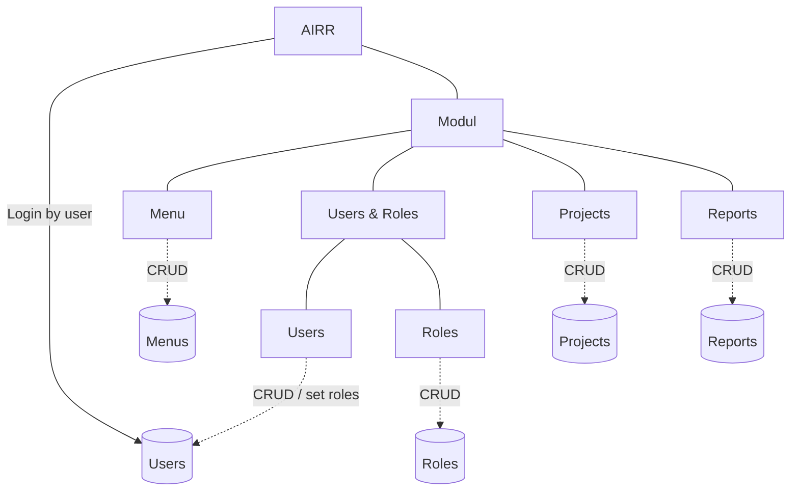

# AIRR — RBAC & Authoring Model (M1 · M6 · M14)

> Confirmed against the implemented schema on 2026-06-27. Groups removed; access
> flows User → Role → Permission, and authoring (Reports) is project-scoped with
> per-report ACL ("permission mengikut item"). Source of truth for the diagram
> the team sketched.

## Module map



## Entity relationships (as built)

```mermaid
erDiagram
  USERS ||--o{ ROLE_USER : has
  ROLES ||--o{ ROLE_USER : "granted to"
  ROLES ||--o{ PERMISSION_ROLE : has
  PERMISSIONS ||--o{ PERMISSION_ROLE : "granted to"
  MENUS ||--o{ MENUS : "parent (1:M)"
  PROJECTS ||--o{ REPORTS : "owns (1:M)"
  USERS }o--o| PROJECTS : "current_project_id"
  REPORTS ||--o{ REPORT_ROLE : "ACL grant"
  ROLES ||--o{ REPORT_ROLE : "granted on report"

  USERS { bigint id string email string user_type fk current_project_id }
  ROLES { bigint id string slug int clearance }
  PERMISSIONS { bigint id string key }
  MENUS { bigint id fk parent_id string route string permission }
  PROJECTS { bigint id string code string color }
  REPORTS { bigint id fk project_id fk created_by jsonb definition }
  REPORT_ROLE { fk report_id fk role_id bool can_view bool can_edit bool can_run }
```

## Confirmation vs code

| Diagram element | Implemented as | ✓ |
|---|---|---|
| Menu access · CRUD | `menus` table (self 1:M via `parent_id`), MenuController, permission-filtered nav | ✅ |
| Login by user | Sanctum auth; `users` | ✅ |
| Users 1:M Roles | `role_user` pivot (M:N — a user has many roles) | ✅ |
| Roles 1:M Permission | `permission_role` pivot | ✅ |
| Project (CRUD) | `projects`; `users.current_project_id` = default scope | ✅ |
| Reports M:1 Project | `reports.project_id` | ✅ |
| Reports 1:M Permission ("permission mengikut item") | `report_role` (role × can_view/can_edit/can_run) | ✅ |
| ~~Groups~~ | Removed (migration `remove_user_groups`) | ✅ |

_All authoring (reports/templates) is scoped to a project — every user has a current project, defaulted on login._
